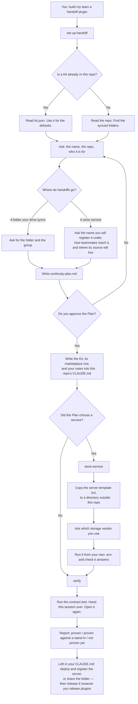

# 100x-continuity — build your team a session handoff

Your teammates finish work in Claude and someone else has to carry it on — tomorrow, on
another machine, in another person's account. This gives them a way to do that: one short
code to send, and the whole session picks up on the other side.

**It is a factory, not the tool itself.** You install this in Claude Code, answer some
questions about your team and where your files live, and it writes a plugin — tailored to
you, with your team's storage baked in — into your own plugin repository. Your teammates
install *that*, and never see this.

```
you, in Claude Code                    your teammates, in Cowork
┌────────────────────┐                 ┌──────────────────────────┐
│  100x-continuity   │  writes a       │  <your-team>-handoff     │
│  set-up-handoff    │  plugin into ──▶│  hand-off · pick-up      │
│  verify            │  your repo      │                          │
└────────────────────┘                 └──────────────────────────┘
```

## How setting it up goes



The service store's name is settled **before** anything is written, and the server is
built to answer to it afterwards. Asking for the name once a server already exists is how
a Kit and a server end up never meeting, which nothing reports.

## What your teammates get

Two skills, in ordinary words. No configuration, nothing to set up, no store to choose —
that was decided when the plugin was generated.

| They say | What happens |
| --- | --- |
| *"hand this over to Dana"* | The conversation and the files they name are packaged, scrubbed of anything credential-shaped, and filed. They get one short code back to send. |
| *"pick up what Dana sent — `<code>`"* | The code is opened and verified, and the work continues: what was asked, where it stopped, and the files that came with it. |

## Using the factory

```
/plugin marketplace add 100xopensource/100xtools
/plugin install 100x-continuity@100xtools
```

Then, from inside the plugin repository your organisation ships from:

| Skill | When | What it does |
| --- | --- | --- |
| `set-up-handoff` | say what you want | interviews you, writes `continuity-plan.md`, waits for one yes, writes the plugin and its marketplace row, then verifies it |
| `verify` | on its own, later | proves a kit round-trips — for "a teammate says pick-up is broken" |
| `store-service` | only for a service store | copies out the MCP server, gets credentials, runs it locally |

`set-up-handoff` runs once. What is still yours afterwards — deploying and registering the
server, or sharing the folder, then releasing the plugin — is written into a marked section
of your repository's `CLAUDE.md`, because a conversation ends and a repository does not.
Only the text between that section's markers is ever rewritten, and the markers carry the
Kit's name so a repo can ship two.

One entry point. `set-up-handoff` does the interview, writes the plugin, and checks it in a
single run. It stops one time only: it asks you to approve the Plan. `docs/adr/0001-one-setup-skill.md`
records why.

Nothing is branched, committed, or pushed. You release it however your org releases
plugins — for most, merging to the marketplace repo's main branch is the release.

Python 3.11+, standard library only. Nothing to build, nothing to install, no lockfile.

## Where handoffs are kept

Two choices, and the difference that matters is **who can read a handoff**.

**A folder** your cloud drive already syncs — OneDrive, SharePoint, iCloud Drive, Google
Drive, Dropbox. Works today, nothing to run. Anyone who can open the folder can read every
handoff in it; sharing the folder shares all of it, past and future.

**A service** — object storage behind an MCP server you run. The server holds the storage
credential, decides who may read which handoff, and hands the generated plugin nothing but
a short-lived URL. This is the only way to hand one session to one person, and it costs you
a process to keep running.

Teammates reach it one of two ways: you register it with your organisation's connectors, or
the generated plugin carries its own declaration of it. A plugin emitted before its server
exists points at a reserved example domain and says so in your notes.

`templates/store-service/` is a working FastMCP implementation with a Dockerfile. Deploying
it is yours — and it belongs **outside** the repository the plugin ships from, because a
plugin marketplace is a git clone: installing one plugin from it copies the whole repository
to every teammate's machine.

## What travels, and what does not

**Travels:** the conversation, a readable summary of it, and the files chosen at handoff.
Everything is packaged as one zip with a human-readable landing page, named for the digest
of its own contents — so the same session and the same files package identically on two
machines, and an unchanged resend is recognised rather than filed twice.

**Removed on the way out:** credential-shaped values — key prefixes, `Authorization`
headers, JWTs, PEM blocks, values whose key names them a secret. Files travel verbatim,
so a file that looks like it holds a credential stops the handoff and asks, rather than
being silently rewritten.

**Never read at all:** the host's signed audit log (cost, tokens, permission decisions)
and its session metadata (the assembled system prompt, the map of enabled connectors and
tools). A handoff is a record of the conversation, not of the machine it ran on.

Redaction matches shapes. It will not catch a secret written out in prose, an internal
hostname, or personal data someone typed into a prompt. Nothing here describes a handoff
as safe or clean, and neither should you.

## How it works underneath

Nothing runs in the background and nothing is captured. The host already writes each
session to `<project-dir>/<session-id>.jsonl`; the generated plugin reads that file when
told to, and only then.

Reads are verified against the digest recorded when the handoff was written. Sync clients
reclaim disk by dropping a file's contents while leaving its name in place, and a plain
read returns short bytes with no error — so short bytes report as *not materialized yet*
(wait for the client) and full-length wrong bytes report as corruption (ask for a resend).
The two have different remedies, so they are never reported as the same thing.

Nothing in a store is ever rewritten. Two machines editing one index inside a synced folder
produce a conflict copy, and a reader gets whichever half the client picked — so handoffs
are named for the moment they were sent plus their own digest, and a second one lands
beside the first rather than over it.

## Developing on it

```bash
cd plugins/100x-continuity
PYTHONPATH=scripts python3 -m unittest discover -s tests -p 'test_*.py'
```

The engine is under `scripts/engine/`: `transcript.py` finds and reads the host's
transcript, `digest.py` turns records into a readable page, `redact.py` is the boundary
transform, `bundle.py` packs and verifies, `store.py` files and resolves, `config.py`
holds the precedence, `cli.py` is the JSON-only surface. `scripts/emit.py` is the only
factory-side module — it writes Kits and never ships inside one.

Every emitted Kit carries `tests/contract_test.py`: deterministic, no model, no network,
run against a synthetic session in a throwaway home. It is what gates a release, and CI
here emits a Kit and runs it.

`redact.py` is a trust boundary: it is the only thing between a full session transcript
and a folder that syncs to somebody's cloud account. Changes there need a second reader,
and they only ever tighten.
