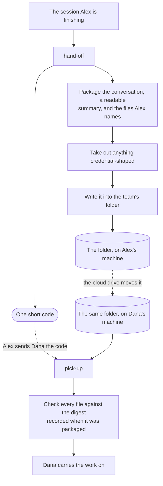

Three things that diagram is trying to show:

- **Nothing runs in the background, and nothing is captured.** The cloud drive does all
  the moving. This plugin writes a file when told to and reads one when told to.
- **The code is not a link.** It is the address of a folder inside the shared folder, so
  it only resolves for somebody whose machine has that shared folder too.
- **The digest check is what tells the two bad reads apart.** A sync client can leave a
  file's name in place while dropping its contents, which reads as a short, empty, error-free
  file. Short bytes mean *wait, it is still coming down*; full-length wrong bytes mean
  *damaged, ask for it again*. The remedies are different, so they are never reported as
  one thing.
