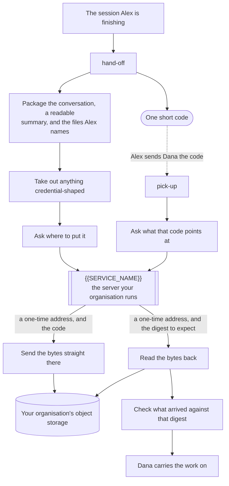

Three things that diagram is trying to show:

- **The server hands out addresses, not contents.** The conversation goes straight between
  the machine and the storage. It never travels through the server, and it never travels
  through a tool result either.
- **The server decides who reads what.** A handoff is readable by the person who sent it
  until they share it. A refusal is an access decision, not a missing handoff — one message
  to the sender fixes it, and there is no other route to try.
- **The digest is what makes the read trustworthy.** The server says what it holds, and
  `pick-up` refuses anything whose bytes disagree. There is one bad read here, not two, and
  waiting never fixes it — nothing is syncing in the background.
